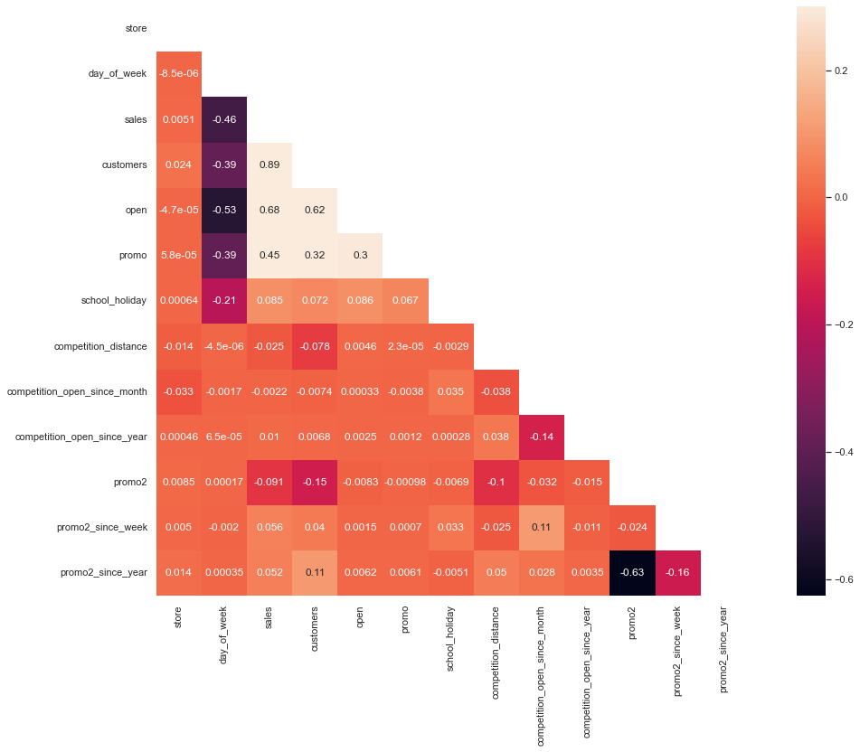

# Project Rossmann - Sales Predict with Machine Learning

### This project is an application of machine learning models to predict sales based on public pharmaceutical stores data from Rossman provided by Kaggle. The project is not intended to propose solutions for the company, being only an object of demonstration of analytical skills and machine learning.
- Dataset Link: https://www.kaggle.com/competitions/rossmann-store-sales/data

  

## Understanding Business Questions 

Rossmann operates over 3,000 drug stores in 7 European countries. Currently,
Rossmann store managers are tasked with predicting their daily sales for up to six weeks in advance. Store sales are influenced by many factors,
including promotions, competition, school and state holidays, seasonality, and locality.
With thousands of individual managers predicting sales based on their unique circumstances, the accuracy of results can be quite varied.

- At a meeting with the leads of each department, the Rossmann's CFO made a proposal to renovate all of their store.

- The Rossmann's CFO wants to predict the next 6 weeks sales for each store, so he can bring forward part of this revenue to renovate them.

- The CFO, who directly requested the answer for the problem.

- Granularity: daily sales for 6 weeks / store.

- Problem type: sales prediction.

## Solution Planning

1. An ovewview at data description and create Hypothesis to analyse realtionship between variables to help in data selection for machine learning model.
2. Create a mindmap to understand features and build hypothesis.

    

3. Feature engineering to help analyze the hypotheses and add some more informations.
4. Exploratory data analysis to understand distribuition, scale, nature, correlations, etc...
5. Data preparation to tranform nature, encoding and rescaling data.
6. Feature selection to help ML model .
7. Applying ML models for sales prediction and compare which one has better error measures.
8. Hyperparemeter Fine Tuning to improve the performance of the selected model.
9. Error interpretation, make results easier for non-technical people.
10. Deploy model to production

## Main Insights

#### Hypothesis creation and correlation visualization.

- H1: Stores with the highest assortment are expected sell more, on average
  - **TRUE - Stores that have extra assortment sell 18% more than extended and, extended assortment sells 10% more than basic assortment**

- H2: Stores in promotion are expected to sell more, on average
  - **TRUE - Stores that have promotion sell 10% more**
  
- H3: Stores with close competitors should sell less, on average.
  - **FALSE - The distance from the competitor does not significantly influence sales**
  
- H4: Stores should sell more in holidays, on average
  - **TRUE - The average sales are higher on holidays than regular days, regular days have the lowest average sales**

- H5: Christmas is the best selling holiday
  - **FALSE - Easter holiday is the holiday that has the highest sales**

- H6: Stores with more time of promotion should sell more
  - **FALSE - Stores with more consecutive promotions sell less**

- H7: Stores with longer competitors are expected to sell more.
  - **FALSE - Stores that have competitior that have recently opened sell more, there is a drop in sales over time**
  
- H8: Stores sells more in the second semester, on average
  - **TRUE - Stores sell 2.7% more in the second semester**

- H9: Stores should sell more over the years 
  - **TRUE - Stores sell about 2% more over year, on average**

- H10: Stores sell more on weekends
  - **FALSE - Stores sell less on weekends**

#### Hypotheses and results:

|Hypothesis  |  Conclusion  |  Relevance  |
|----------- | -----------  | ------------|
|H1          | True         | Low         |
|H2          | True         | Medium      |
|H3          | False        | High        |
|H4          | True         | low         |
|H5          | False        | Medium      |
|H6          | False        | High        |
|H7          | False        | High        |
|H8          | True         | Medium      |
|H9          | True         | Low         |
|H10         | False        | Medium      |

## Correlation

#### Numeric - Pearson Correlation

 

#### Categoric - Cramer V

 

## Machine Learning Models

The following machine learning models were considered for sales prediction: Linear Regression, Lasso Regression and Random Forest Regressor.

To evaluate the performance of the models, cross-validation was considered and the error measures were: the Mean Absolute Error (MAE), the Mean Absolute Percentage Error (MAPE) and the Root Mean Squared Error (RMSE). The average cross-validation error as well their respective standard deviation are ilustrated in the table below:

|       Model Name          |        MAE CV       |    MAPE CV    |      RMSE CV       |
|:-------------------------:|:-------------------:|:-------------:|:------------------:|
| Linear Regression         |  2081.73 +/- 295.63 | 0.30 +/- 0.02 | 2952.52 +/- 468.37 |
| Lasso Regression          |  2112.89 +/- 342.63 |	0.29 +/- 0.01	| 3048.46 +/- 508.15 |
| Random Forest Regressor   |  836.28 +/- 216.97	| 0.12 +/- 0.02	| 1253.85 +/- 316.02 |

Random Forest Regressor had the best error measures. With hyperparameter tuning process, were obteined the following measures:

|    Model Name        |     MAE      |    MAPE    |     RMSE       |
|:--------------------:|:------------:|:----------:|:--------------:|
| Random Forest Regressor   |	676.552722 |	0.099234	|1013.124493|

#### Model residuals analyses

 

We can observe in the plots that the residuals do not show patterns of asymmetry or that contradict the assumption of normality.

## Business Performance

MAE means how much the prediction is wrong, defining upper and lower bounds and is not sensitive to outliers. MAPE means the percentage that predicted values are different when compared to real ones. 

The table below shows the worst store predictions, explaining that some stores are more difficult to predict sales. The worst_scenario field is calculated by subtracting the MAE from the predictions field and the best_scenario field is calculated by adding the MAE field.

|   store |   predictions |   worst_scenario |   best_scenario |      MAE |     MAPE |
|--------:|--------------:|-----------------:|----------------:|---------:|---------:|
|292|	5706.674949	|91452.804544	 |  387907.891153	|3529.227222|	0.605392|
|909|	10513.258469|	144981.273466|	738132.437896	|7061.323386|	0.476744|
|550|	6903.650394	|218346.648649 |	361559.984469	|1704.920665|	0.344712|
|876|	9214.511315	|222029.050287 |	551989.900145	|3928.105355|	0.303367|
|722|	9521.673536	|317038.702703 |  482781.874342	|1973.132996|	0.266351|

How we can see in table below, the store 292 has a MAPE = 0.60, what means that predicts sales for this store , on average, are 60% distant from the real.

In the plot below we can see the dispersion of MAPE for each store. On average the MAPE are in 10%, showing that the predictions are adequate.

  

Finally, we have the sum for all stores predctions sales for the next six weeks, as well as the worst and best scenarios:

| Scenario       | Values           |
|:---------------|:-----------------|
| Next Six Week  | €326,908,867.73  |
| Worst Scenario | €294,930,500.77  |
| Best Scenario  | €358,887,234.69  |

